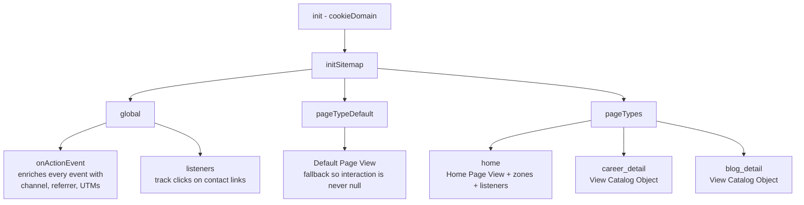

# MCP — Marketing Cloud Personalization assets

Source-of-truth for everything we deploy into Salesforce Marketing Cloud
Personalization for `https://www.bombonato.net`.

## Layout

```
mcp/
├── README.md                          ← this file
├── sitemap.js                         ← Sitemap JS (paste into MCP Visual Editor → Sitemap)
└── templates/
    ├── related_careers.hbs            ← Handlebars markup (paste into Handlebars tab)
    ├── related_careers.ts             ← Serverside Code (paste into Serverside Code tab)
    ├── related_blog.hbs               ← Handlebars markup (paste into Handlebars tab)
    └── related_blog.ts                ← Serverside Code (paste into Serverside Code tab)

catalog/articles.csv                   ← Catalog feed (generated, served at /catalog/articles.csv)
tools/generate_catalog_feed.py         ← Regenerates the CSV from Jekyll _posts
```

Each Web Campaign template in MCP has 4 tabs (`Handlebars`, `CSS`,
`Clientside Code`, `Serverside Code`). We only need the first and the
last: the `.hbs` files carry the markup; the `.ts` files carry the
recommendation binding (`RecommendationsConfig + recommend` from
`recs`). The Recipe itself is **selected by the marketer in the Campaign
editor**, not hardcoded — so the same template can power both the
careers and the blog widget if you reassign the recipe.

## Workflow

1. **Edit** the relevant file in this folder (e.g. `sitemap.js`).
2. **Commit** the change so we have history of what was deployed.
3. **Apply** in MCP:
   - Open MCP UI → Web → Sitemap → tab "Sitemap JS"
   - Paste full file contents
   - SAVE → EXECUTE (dry-run) → PUBLISH

## Why we version this

- MCP UI has version history but it's painful to diff.
- Local files give us git blame, code review, and the ability to roll
  back instantly.
- The agent (Cursor) can edit `sitemap.js` directly and only ask the
  human to copy/paste into MCP.

## Catalog model

- **Item Type**: `Article`
- **Categories** (polymorphic, `type: "c"`):
  - `career` → Carreira
  - `blog` → Blog
- **Tags** (polymorphic, `type: "t"`): free-form, from `data-article-tags`
  CSV on the `<article>` element
- **Attributes (all articles)**: `name`, `url`, `author`, `publishDate`,
  `description`, `topics` (MultiString — array of strings)
- **Attributes (career only)**: `company`, `startDate`, `endDate`,
  `location`, `industry`, `seniority`, `technologies`

## Sitemap architecture



## Custom interactions sent by the sitemap

| Name                      | When                                           | Extra fields                  |
|---------------------------|------------------------------------------------|-------------------------------|
| `Default Page View`       | Any page that doesn't match a defined pageType | —                             |
| `Home Page View`          | URL is `/`                                     | —                             |
| `View Catalog Object`     | Career or blog detail pages                    | full catalogObject            |
| `View Experience Details` | Click on "Mais detalhes" on home cards         | `role`, `company`             |
| `Contact Click`           | Click on mailto / linkedin / github links      | `destination`, `kind`         |

## Gotchas (lessons learned)

### `interaction:` (singular) — NOT `interactions:` (plural)

The pageType-level interaction key is **singular** (`interaction`). If
you write `interactions: [{...}]` (plural array form), the SDK
silently ignores it and sends events with `interaction: null`. The
MCP server then rejects those events with **400 Bad Request**, and
because the 400 response lacks CORS headers, the browser surfaces it
as a **CORS error** in the console.

Diagnosis tip: if you see "CORS blocked" + 400 on `/api2/event/...`,
the smoking gun is `"interaction": null` in the decoded payload of the
failing request. The fix is renaming the key, not anything related to
the dataset's allowed domains or auth.

### Always provide `pageTypeDefault`

Without a `pageTypeDefault.interaction`, any page view that doesn't
match a pageType ends up with `interaction: null`, triggering the
same 400 + CORS pattern as above.

### `topics` is MultiString

The MCP catalog attribute `topics` is configured as MultiString
(array of strings). We send it via `fromCsvAttr`, which returns an
array. Do not switch to `fromSelectorAttribute` (which returns a CSV
string) unless you also change the catalog attribute back to String.

### Handlebars helpers in MCP are limited — no `gt`, `lt`, `eq`, etc.

MCP's Handlebars engine only ships the built-in helpers (`#if`,
`#each`, `#with`, `#unless`, `lookup`, `log`) plus a few MCP-specific
ones (`formatDate`, `formatCurrency`). Comparison helpers like `gt`,
`lt`, `eq`, `and`, `or` are **not registered** and throw
`ReferenceError: gt is not defined` at render time.

For "is the array non-empty?" use `{{#if items.length}}` — an empty
array has `length: 0`, which Handlebars treats as falsy.

### `isMatch` runs early — use `matchWhenReady` for DOM-based matches

`SalesforceInteractions.initSitemap` may run before the `<article>`
element is in the DOM on the first navigation. A synchronous
`document.querySelector(...)` returns `null` in that window. The
`matchWhenReady` helper returns a Promise that resolves either on
`DOMContentLoaded` or after a 1.5s safety timeout.

## Content zones currently declared

| Zone              | Defined on                      | Selector                  |
|-------------------|---------------------------------|---------------------------|
| `hero_banner`     | `home`                          | `header, .hero`           |
| `main_content`    | `home`                          | `main, body`              |
| `related_careers` | `career_detail`, `blog_detail`  | `#mcp-related-careers`    |
| `related_blog`    | `career_detail`, `blog_detail`  | `#mcp-related-blog`       |

The `related_*` zones are rendered as hidden `<aside>` blocks in
`_layouts/career.html` and `_layouts/blog.html`. They appear once
an MCP Web Campaign injects items into the inner `.related-grid`
(CSS rule `.related-articles:has(.related-grid:not(:empty))`).

## Recipes & Campaigns (managed in MCP UI)

| Recipe                       | Type    | Filter                  | Target Zone        |
|------------------------------|---------|-------------------------|--------------------|
| `Related Career Experiences` | Article | `categories._id=career` | `related_careers`  |
| `Related Blog Articles`      | Article | `categories._id=blog`   | `related_blog`     |

Each recipe is consumed by a Web Campaign that:
1. Targets pages matching `career_detail` OR `blog_detail`
2. Renders into its respective zone
3. Uses a Handlebars template producing `.related-card` markup
   (already styled in `assets/css/demo.css`)

### Catalog Feed (`catalog/articles.csv`)

Beacon events update Article attributes and increment Category view
counts, but they do **not** auto-populate the `Article.categories`
relation. Without that relation, recipes filtering on `Category =
career` (or `Category = blog`) return zero items, and any related-
items campaign renders empty.

The fix is to bulk-load Articles via a CSV catalog feed. The feed is
the **source of truth** for the relation between Articles and
Categories; beacon events keep handling behavioral signals and
attributes.

**Workflow**

1. Edit posts in `career/_posts/` or `blog/_posts/` as usual.
2. From the repo root, regenerate the CSV:
   ```bash
   python3 tools/generate_catalog_feed.py
   ```
   Output: `catalog/articles.csv`, one row per post, 15 columns.
3. Commit `catalog/articles.csv` (and any post edits).
4. Push to GitHub Pages. Jekyll serves the CSV at
   `https://www.bombonato.net/catalog/articles.csv`.
5. In MCP UI → Feeds Dashboard → upload or point at the URL → ETL =
   `Catalog Object ETL` → Validate → Commit.

**CSV schema**

| Column                       | Notes                                             |
|------------------------------|---------------------------------------------------|
| `id`                         | `YYYYMM-slug`, matches the value the sitemap sends |
| `categories`                 | `career` or `blog` (one value per Article)        |
| `attribute:name`             | `[Carreira] …` or `[Blog] …` prefix               |
| `attribute:url`              | Absolute URL                                      |
| `attribute:author`           | Hardcoded to site author                          |
| `attribute:publishDate`      | Post date (YYYY-MM-DD)                            |
| `attribute:description`      | Front matter `description:` or first ~200 chars   |
| `attribute:company`          | Career only                                       |
| `attribute:startDate`        | Career only                                       |
| `attribute:endDate`          | Career only — empty if "ATUAL"                    |
| `attribute:location`         | Career only                                       |
| `attribute:industry`         | Career only                                       |
| `attribute:seniority`        | Career only                                       |
| `attribute:topics`           | MultiString — pipe-separated (`a|b|c`)            |
| `attribute:technologies`     | Career only — pipe-separated                      |

**Why no SFTP**

MCP also supports SFTP-based feed delivery. We use the HTTP variant
because GitHub Pages already hosts the site over HTTPS, so the CSV is
deployed as part of the regular Jekyll build pipeline — no extra
infrastructure required. If the feed grows or needs scheduling, swap
to SFTP without changing the upstream generator.

### Template Serverside Code (`recs` module)

MCP Personalization exposes the Recommendations API via the `recs`
module. Templates that need recipe-driven items follow this pattern:

```ts
import { RecommendationsConfig, recommend } from "recs";

export class RelatedCareersTemplate implements CampaignTemplateComponent {
    @title("Recommendation Settings")
    recsConfig: RecommendationsConfig = new RecommendationsConfig();

    run(context: CampaignComponentContext) {
        try {
            return { items: recommend(context, this.recsConfig) };
        } catch (e) {
            return { items: [] };
        }
    }
}
```

Key points:

- Keep `new RecommendationsConfig()` **minimal**. Do **not** call
  `.restrictItemType("Article")` — on a single-Item-Type catalog it
  throws `"Error occurred while processing server-side template code"`
  at runtime. The Recipe's own filter handles the type restriction.
- The `@title`/`@subtitle` decorators expose the recipe picker in the
  Campaign editor — the marketer chooses which Recipe runs.
- `recommend(context, recsConfig)` returns an array of catalog items
  shaped like `{ _id, type, attributes: { ... } }`, which the
  Handlebars template iterates with `{{#each items}}`.
- The `try/catch` is **defensive** — see the gotcha below.
- For programmatic / hardcoded recipes (no marketer picker), use
  `context.services.recommendations.recommend({ recipeId, ... })`
  inside `run()` instead.

### `recommend()` may throw a System Service Exception — wrap it

When `recommend(context, this.recsConfig)` runs and any of these is
true, MCP throws at the call site:

```
Server: System service exception via
  [recommend : context.services.recommendations.recommend(request)]
```

Common triggers:

1. **No Recipe picked in the Campaign yet.** `new RecommendationsConfig()`
   surfaces a Recipe picker in the Campaign editor; if it is empty,
   `recommend()` has no `recipeId` to execute and throws.
2. **Recipe filters on Categories before the CSV ETL has run.**
   The beacon does not populate `Article.categories`. Without
   `catalog/articles.csv` ingested, a Recipe filtering on
   `Category = career` (or `blog`) finds no eligible items and
   throws instead of returning empty.
3. **Recipe references an attribute that is not registered on the
   Item Type** (e.g. `author`, `publishDate` — both unregistered;
   use the System Attribute `published` instead).
4. **Strict Catalog Security is ON.** Toggle OFF at
   `Settings → Catalog and Profile Objects → Catalog Settings →
   Security → Enable Strict Catalog Security` — when ON the beacon
   only registers item IDs and Recipes that read attributes fail.
5. **Recipe expects "related to current item" but the page has no
   active catalog object in context** (e.g. testing the campaign on
   `/` or any page without a `ViewCatalogObject` event).

The unhandled exception kills the entire campaign render — the user
sees a broken zone. Wrapping `recommend()` in `try/catch` returns an
empty `items` array, and the Handlebars guard `{{#if items.length}}`
+ the CSS rule `.related-articles:has(.related-grid:not(:empty))`
hide the widget cleanly.

Diagnosis recipe:

1. Open the page in an incognito window with the Chrome
   "Salesforce Interactions SDK Launcher" extension.
2. Check that `View Catalog Object` fires with the correct
   `catalogObject.id` and `categories: [...]`.
3. In MCP UI → Campaigns → the affected campaign → open the
   template settings → confirm a Recipe is selected.
4. In MCP UI → Recipes → open that Recipe → run **Test/Preview**
   with a real Profile ID; if it errors here, the Recipe (not the
   template) is the cause.
