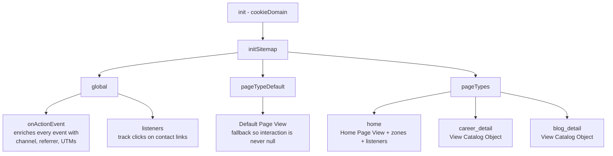

# MCP — Marketing Cloud Personalization assets

Source-of-truth for everything we deploy into Salesforce Marketing Cloud
Personalization for `https://www.bombonato.net`.

## Layout

```
mcp/
├── README.md                          ← this file
├── sitemap.js                         ← Sitemap JS (paste into MCP Visual Editor → Sitemap)
└── templates/
    ├── related_careers.hbs            ← Handlebars markup — design-only, see note
    ├── related_careers.js             ← Clientside Code — renders cards manually
    ├── related_careers.ts             ← Serverside Code — recs binding
    ├── related_blog.hbs               ← Handlebars markup — design-only, see note
    ├── related_blog.js                ← Clientside Code — renders cards manually
    └── related_blog.ts                ← Serverside Code — recs binding

catalog/articles.csv                   ← Catalog feed (generated, served at /catalog/articles.csv)
tools/generate_catalog_feed.py         ← Regenerates the CSV from Jekyll _posts
```

Each Web Campaign template in MCP has 4 tabs (`Handlebars`, `CSS`,
`Clientside Code`, `Serverside Code`). We version three of them and
they play distinct roles:

| Tab               | Versioned file | Role                                              |
|-------------------|----------------|---------------------------------------------------|
| `Serverside Code` | `.ts`          | Binds the marketer-selected Recipe → returns `items` |
| `Clientside Code` | `.js`          | **Renders** the cards manually + fires tracking — see strategy below |
| `Handlebars`      | `.hbs`         | Design-only mirror of the card DOM. Kept in sync with `.js` so the markup contract is reviewable, but no longer in the render path |
| `CSS`             | —              | Not versioned. The `.related-card` styles live in `assets/css/demo.css` and ship with the Jekyll site |

The Recipe itself is **selected by the marketer in the Campaign
editor**, not hardcoded — so the same template can power both the
careers and the blog widget if you reassign the recipe.

## Workflow

1. **Edit** the relevant file in this folder (e.g. `sitemap.js`).
2. **Commit** the change so we have history of what was deployed.
3. **Apply** in MCP:
   - Open MCP UI → Web → Sitemap → tab "Sitemap JS"
   - Paste full file contents
   - SAVE → EXECUTE (dry-run) → PUBLISH

## Why we version this

- MCP UI has version history but it's painful to diff.
- Local files give us git blame, code review, and the ability to roll
  back instantly.
- The agent (Cursor) can edit `sitemap.js` directly and only ask the
  human to copy/paste into MCP.

## Catalog model

- **Item Type**: `Article`
- **Categories** (polymorphic, `type: "c"`):
  - `career` → Carreira
  - `blog` → Blog
- **Tags** (polymorphic, `type: "t"`): free-form, from `data-article-tags`
  CSV on the `<article>` element
- **Attributes (all articles)**: `name`, `url`, `author`, `publishDate`,
  `description`, `topics` (MultiString — array of strings)
- **Attributes (career only)**: `company`, `startDate`, `endDate`,
  `location`, `industry`, `seniority`, `technologies`

## Sitemap architecture



## Custom interactions sent by the sitemap

| Name                      | When                                           | Extra fields                  |
|---------------------------|------------------------------------------------|-------------------------------|
| `Default Page View`       | Any page that doesn't match a defined pageType | —                             |
| `Home Page View`          | URL is `/`                                     | —                             |
| `View Catalog Object`     | Career or blog detail pages                    | full catalogObject            |
| `View Experience Details` | Click on "Mais detalhes" on home cards         | `role`, `company`             |
| `Contact Click`           | Click on mailto / linkedin / github links      | `destination`, `kind`         |

## Custom interactions sent by the template Clientside Code

These fire from `mcp/templates/related_*.js`, **not** from the sitemap.
They run inside the rendered Campaign so the impression is only counted
when the template actually drew cards on the page.

Each widget uses a **distinct event name** — sharing a single name
across both widgets trips the MCP beacon's client-side rate limiter
when both render on the same detail page (see the gotcha below).

| Name                    | When                                                    | Extra fields                                       |
|-------------------------|---------------------------------------------------------|----------------------------------------------------|
| `View Related Careers`  | `related_careers` widget rendered ≥1 card, once/page    | `widget`, `itemCount`                              |
| `Click Related Career`  | Visitor clicked a card in `related_careers`             | `widget`, `targetId`, `targetName`, `destination`  |
| `View Related Blog`     | `related_blog` widget rendered ≥1 card, once/page       | `widget`, `itemCount`                              |
| `Click Related Blog`    | Visitor clicked a card in `related_blog`                | `widget`, `targetId`, `targetName`, `destination`  |

## Gotchas (lessons learned)

### `interaction:` (singular) — NOT `interactions:` (plural)

The pageType-level interaction key is **singular** (`interaction`). If
you write `interactions: [{...}]` (plural array form), the SDK
silently ignores it and sends events with `interaction: null`. The
MCP server then rejects those events with **400 Bad Request**, and
because the 400 response lacks CORS headers, the browser surfaces it
as a **CORS error** in the console.

Diagnosis tip: if you see "CORS blocked" + 400 on `/api2/event/...`,
the smoking gun is `"interaction": null` in the decoded payload of the
failing request. The fix is renaming the key, not anything related to
the dataset's allowed domains or auth.

### Always provide `pageTypeDefault`

Without a `pageTypeDefault.interaction`, any page view that doesn't
match a pageType ends up with `interaction: null`, triggering the
same 400 + CORS pattern as above.

### `topics` is MultiString

The MCP catalog attribute `topics` is configured as MultiString
(array of strings). We send it via `fromCsvAttr`, which returns an
array. Do not switch to `fromSelectorAttribute` (which returns a CSV
string) unless you also change the catalog attribute back to String.

### Handlebars helpers in MCP are limited — no `gt`, `lt`, `eq`, etc.

MCP's Handlebars engine only ships the built-in helpers (`#if`,
`#each`, `#with`, `#unless`, `lookup`, `log`) plus a few MCP-specific
ones (`formatDate`, `formatCurrency`). Comparison helpers like `gt`,
`lt`, `eq`, `and`, `or` are **not registered** and throw
`ReferenceError: gt is not defined` at render time.

For "is the array non-empty?" use `{{#if items.length}}` — an empty
array has `length: 0`, which Handlebars treats as falsy.

### `isMatch` runs early — use `matchWhenReady` for DOM-based matches

`SalesforceInteractions.initSitemap` may run before the `<article>`
element is in the DOM on the first navigation. A synchronous
`document.querySelector(...)` returns `null` in that window. The
`matchWhenReady` helper returns a Promise that resolves either on
`DOMContentLoaded` or after a 1.5s safety timeout.

## Content zones currently declared

| Zone              | Defined on                      | Selector                  |
|-------------------|---------------------------------|---------------------------|
| `hero_banner`     | `home`                          | `header, .hero`           |
| `main_content`    | `home`                          | `main, body`              |
| `related_careers` | `career_detail`, `blog_detail`  | `#mcp-related-careers`    |
| `related_blog`    | `career_detail`, `blog_detail`  | `#mcp-related-blog`       |

The `related_*` zones are rendered as hidden `<aside>` blocks in
`_layouts/career.html` and `_layouts/blog.html`. They appear once
an MCP Web Campaign injects items into the inner `.related-grid`
(CSS rule `.related-articles:has(.related-grid:not(:empty))`).

## Recipes & Campaigns (managed in MCP UI)

| Recipe                       | Type    | Filter                  | Target Zone        |
|------------------------------|---------|-------------------------|--------------------|
| `Related Career Experiences` | Article | `categories._id=career` | `related_careers`  |
| `Related Blog Articles`      | Article | `categories._id=blog`   | `related_blog`     |

Each recipe is consumed by a Web Campaign that:
1. Targets pages matching `career_detail` OR `blog_detail`
2. Renders into its respective zone
3. Uses a Handlebars template producing `.related-card` markup
   (already styled in `assets/css/demo.css`)

### Catalog Feed (`catalog/articles.csv`)

Beacon events update Article attributes and increment Category view
counts, but they do **not** auto-populate the `Article.categories`
relation. Without that relation, recipes filtering on `Category =
career` (or `Category = blog`) return zero items, and any related-
items campaign renders empty.

The fix is to bulk-load Articles via a CSV catalog feed. The feed is
the **source of truth** for the relation between Articles and
Categories; beacon events keep handling behavioral signals and
attributes.

**Workflow**

1. Edit posts in `career/_posts/` or `blog/_posts/` as usual.
2. From the repo root, regenerate the CSV:
   ```bash
   python3 tools/generate_catalog_feed.py
   ```
   Output: `catalog/articles.csv`, one row per post, 15 columns.
3. Commit `catalog/articles.csv` (and any post edits).
4. Push to GitHub Pages. Jekyll serves the CSV at
   `https://www.bombonato.net/catalog/articles.csv`.
5. In MCP UI → Feeds Dashboard → upload or point at the URL → ETL =
   `Catalog Object ETL` → Validate → Commit.

**CSV schema**

| Column                       | Notes                                             |
|------------------------------|---------------------------------------------------|
| `id`                         | `YYYYMM-slug`, matches the value the sitemap sends |
| `categories`                 | `career` or `blog` (one value per Article)        |
| `attribute:name`             | `[Carreira] …` or `[Blog] …` prefix               |
| `attribute:url`              | Absolute URL                                      |
| `attribute:author`           | Hardcoded to site author                          |
| `attribute:publishDate`      | Post date (YYYY-MM-DD)                            |
| `attribute:description`      | Front matter `description:` or first ~200 chars   |
| `attribute:company`          | Career only                                       |
| `attribute:startDate`        | Career only                                       |
| `attribute:endDate`          | Career only — empty if "ATUAL"                    |
| `attribute:location`         | Career only                                       |
| `attribute:industry`         | Career only                                       |
| `attribute:seniority`        | Career only                                       |
| `attribute:topics`           | MultiString — pipe-separated (`a|b|c`)            |
| `attribute:technologies`     | Career only — pipe-separated                      |

**Why no SFTP**

MCP also supports SFTP-based feed delivery. We use the HTTP variant
because GitHub Pages already hosts the site over HTTPS, so the CSV is
deployed as part of the regular Jekyll build pipeline — no extra
infrastructure required. If the feed grows or needs scheduling, swap
to SFTP without changing the upstream generator.

### Template Serverside Code (`recs` module)

MCP Personalization exposes the Recommendations API via the `recs`
module. Templates that need recipe-driven items follow this pattern:

```ts
import { RecommendationsConfig, recommend } from "recs";

export class RelatedCareersTemplate implements CampaignTemplateComponent {
    @title("Recommendation Settings")
    recsConfig: RecommendationsConfig = new RecommendationsConfig()
        .restrictItemType("Article");

    run(context: CampaignComponentContext) {
        try {
            return { items: recommend(context, this.recsConfig) };
        } catch (e) {
            return { items: [] };
        }
    }
}
```

Key points:

- **`.restrictItemType("Article")` is required**, not optional. Without
  it the picker in the Campaign editor exposes an `Item Type` dropdown
  that defaults to `"Product"` (the MCP placeholder Item Type). Our
  catalog only ships `Article`, so the Recipe dropdown then shows
  **"No options"**, the marketer can't pick a Recipe, and at runtime
  `recommend()` is called with `recipeId: null` and throws the
  "System service exception" — see the gotcha below.
- The `@title`/`@subtitle` decorators expose the recipe picker in the
  Campaign editor — the marketer chooses which Recipe runs.
- `recommend(context, recsConfig)` returns an array of catalog items
  shaped like `{ _id, type, attributes: { ... } }`, which the
  Handlebars template iterates with `{{#each items}}`.
- The `try/catch` is **defensive** — see the gotcha below.
- For programmatic / hardcoded recipes (no marketer picker), use
  `context.services.recommendations.recommend({ recipeId, ... })`
  inside `run()` instead.

### `recommend()` may throw a System Service Exception — wrap it

When `recommend(context, this.recsConfig)` runs and any of these is
true, MCP throws at the call site:

```
Server: System service exception via
  [recommend : context.services.recommendations.recommend(request)]
```

Common triggers:

1. **No Recipe picked in the Campaign yet** (or the picker shows
   "No options" because the Item Type was left as the default
   "Product" — see the previous bullet about `.restrictItemType`).
   Either way, `recommend()` has no `recipeId` to execute and throws.
2. **Recipe filters on Categories before the CSV ETL has run.**
   The beacon does not populate `Article.categories`. Without
   `catalog/articles.csv` ingested, a Recipe filtering on
   `Category = career` (or `blog`) finds no eligible items and
   throws instead of returning empty.
3. **Recipe references an attribute that is not registered on the
   Item Type** (e.g. `author`, `publishDate` — both unregistered;
   use the System Attribute `published` instead).
4. **Strict Catalog Security is ON.** Toggle OFF at
   `Settings → Catalog and Profile Objects → Catalog Settings →
   Security → Enable Strict Catalog Security` — when ON the beacon
   only registers item IDs and Recipes that read attributes fail.
5. **Recipe expects "related to current item" but the page has no
   active catalog object in context** (e.g. testing the campaign on
   `/` or any page without a `ViewCatalogObject` event).

The unhandled exception kills the entire campaign render — the user
sees a broken zone. Wrapping `recommend()` in `try/catch` returns an
empty `items` array, and the Handlebars guard `{{#if items.length}}`
+ the CSS rule `.related-articles:has(.related-grid:not(:empty))`
hide the widget cleanly.

Diagnosis recipe:

1. Open the Template Editor → **TEST** panel → check the
   **Recommendation Settings** card. `Item Type` should be locked to
   `Article`; the `Recipe` dropdown must list at least one option.
   If it shows "No options" the cause is almost always a missing
   `.restrictItemType("Article")` in the Serverside Code.
2. In MCP UI → Campaigns → the affected campaign → open the
   template settings → confirm a Recipe is selected.
3. Open the page in an incognito window with the Chrome
   "Salesforce Interactions SDK Launcher" extension; check that
   `View Catalog Object` fires with the correct `catalogObject.id`
   and `categories: [...]`.
4. In MCP UI → Recipes → open that Recipe → run **Test/Preview**
   with a real Profile ID; if it errors here, the Recipe (not the
   template) is the cause.

### Template Clientside Code — **manual rendering** strategy

The Clientside Code does **not** rely on MCP's `apply()` flow to inject
the Handlebars output. It does the rendering itself by intercepting
the bundle's `registerTemplate` function and reading `source.items`
directly:

```js
(function () {
    "use strict";

    var WIDGET = "related_careers";
    var TARGET_SELECTOR = "#mcp-related-careers";
    var IMPRESSION_NAME = "View Related Careers";
    var CLICK_NAME = "Click Related Career";
    var IMPRESSION_FLAG = "__mcp_impressed_" + WIDGET;

    if (typeof registerTemplate === "function") {
        registerTemplate = function (source) {
            try {
                var items = (source && source.items) || [];
                renderCards(items);
            } catch (e) {
                if (window.Evergage && Evergage.log) {
                    Evergage.log.error(e);
                }
            }
        };
    }

    function renderCards(items) {
        var zone = document.querySelector(TARGET_SELECTOR);
        if (!zone) return;
        if (!Array.isArray(items) || items.length === 0) {
            zone.innerHTML = "";
            return;
        }
        zone.innerHTML = items.map(buildCardHtml).join("");
        attachClickListeners(zone);
        fireImpression(items.length);
    }

    // buildCardHtml, attachClickListeners, fireImpression, escapeHtml,
    // formatDateMonth — see mcp/templates/related_careers.js for full body
})();
```

**Why we bypass `apply()`**

On Rule Based Test campaigns the Content Zone Action could not be
configured to reliably inject into our `<div id="mcp-related-careers">`
target. The server kept returning a full `campaignResponses[].payload.
items` array but `#mcp-related-careers.children.length` stayed at 0
(empty zone, no error). Manual rendering removes that single point of
failure: as long as MCP delivers the bundle (which is the transport
itself), we control what reaches the DOM.

**How the hook works**

The bundle MCP delivers has this shape:

```js
function registerTemplate(source) {
    return TemplateService.registerTemplate(
        Object.assign({}, source, {
            name: 'related_careers',
            handlebars: <compiled .hbs>,
        })
    );
}

try { /* this Clientside Code IIFE */ } catch (e) { /* ... */ }
```

`function registerTemplate(...)` is hoisted, so it lives in our IIFE's
scope. We **reassign** it to a wrapper that grabs `source.items` and
renders the cards ourselves. When MCP later invokes `registerTemplate(
source)` (which is when items are bound), our wrapper fires and the
cards land in `#mcp-related-careers`.

We intentionally do **not** chain the original implementation — calling
it would let MCP's `apply()` also fire (whenever it eventually works)
and we'd risk a duplicate render.

**The `.hbs` becomes design-only**

The `.hbs` files in `mcp/templates/` still mirror the card markup —
they are the visual source-of-truth for the DOM shape we render. The
`buildCardHtml` function in each `.js` file MUST produce the same DOM
(same classes, same `data-cy-*` attributes) because the CSS in
`assets/css/demo.css` and the impression/click tracking selectors
depend on that contract. Touch the `.hbs` and the `.js` together, or
the styles drift.

**Key invariants preserved from the previous architecture**

- **Distinct event names per widget** (`View Related Careers` vs
  `View Related Blog`, same for clicks). Sharing one name trips the
  rate limiter — see the gotcha below.
- **Render-guard**: impression only fires when at least one card was
  actually rendered (now a hard guarantee because we control the
  rendering, not a defensive `cards.length > 0` check).
- **Per-page-load de-dup** via `window.__mcp_impressed_<widget>`. MCP
  can re-execute the Clientside Code on Campaign re-render; without
  the flag we'd fire duplicate impressions.
- **try/catch around every beacon** — tracking failures must never
  break the rendered widget or block the user's click.
- **Per-card `addEventListener`** (re-attached on every render), not a
  document-level delegated listener — listeners die cleanly with the
  cards when MCP re-renders.
- `Click Related *` events are **not** the same as the page-level
  `View Catalog Object` that the sitemap fires on the destination
  page — both should be present for attribution to work.

**HTML/Date helpers**

`buildCardHtml` reads the MCP attribute shape (`attrs.x.value`) defensively
via a `readAttr(attr)` helper (returns `null` when missing). Dates arrive
as **Unix-ms numbers** (e.g. `1738368000000`), formatted to PT-BR via a
local `MONTHS_PTBR` array — we do not depend on the MCP Handlebars
`formatDate` helper because the `.hbs` is no longer in the render path.
All injected strings go through `escapeHtml` / `escapeAttr` to keep the
manually-built innerHTML safe against catalog content with HTML-special
characters.

### `Client: Event Rate Limiter triggered` — distinct names + de-dup

The MCP beacon ships with a client-side throttle that drops bursts
of identically named `sendEvent` calls. When it kicks in, the SDK
logs:

```
Client: Event Rate Limiter triggered
```

…and the offending event never reaches the server, silently
under-counting your dashboard.

Three patterns we hit (now all fixed in `related_*.js`):

1. **Two widgets sharing one `interaction.name`.** On career and
   blog detail pages both widgets render in quick succession; if
   they both dispatch `{name: "View Recommendations"}` back-to-back,
   the second fires the limiter. Fix: give each widget its own
   event name — `View Related Careers`, `View Related Blog`,
   `Click Related Career`, `Click Related Blog`.
2. **Impression fires on Campaign re-render.** MCP can re-execute
   the Clientside Code (Auto Render in the editor, MCP refreshing
   decisions). Same `name`, microseconds apart → throttled. Fix:
   set a `window.__mcp_impressed_<widget>` flag on first dispatch
   and skip subsequent ones in the same page load.
3. **Impression fires on zero-card render.** When the Recipe
   returns nothing, the Handlebars output is empty but the
   Clientside Code still runs and dispatches. Fix: render-guard
   on `cards.length > 0`.

Diagnosis: open the Chrome console with the SDK Launcher extension
on; if you see `Client: Event Rate Limiter triggered`, look at the
preceding events — you'll find two with the same `name` in <1s.
That's your duplicate.
