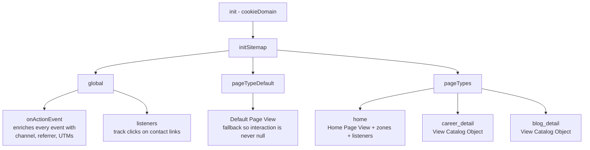

# MCP — Marketing Cloud Personalization assets

Source-of-truth for everything we deploy into Salesforce Marketing Cloud
Personalization for `https://www.bombonato.net`.

## Layout

```
mcp/
├── README.md           ← this file
└── sitemap.js          ← Sitemap JS (paste into MCP Visual Editor → Sitemap)
```

## Workflow

1. **Edit** the relevant file in this folder (e.g. `sitemap.js`).
2. **Commit** the change so we have history of what was deployed.
3. **Apply** in MCP:
   - Open MCP UI → Web → Sitemap → tab "Sitemap JS"
   - Paste full file contents
   - SAVE → EXECUTE (dry-run) → PUBLISH

## Why we version this

- MCP UI has version history but it's painful to diff.
- Local files give us git blame, code review, and the ability to roll
  back instantly.
- The agent (Cursor) can edit `sitemap.js` directly and only ask the
  human to copy/paste into MCP.

## Catalog model

- **Item Type**: `Article`
- **Categories** (polymorphic, `type: "c"`):
  - `career` → Carreira
  - `blog` → Blog
- **Tags** (polymorphic, `type: "t"`): free-form, from `data-article-tags`
  CSV on the `<article>` element
- **Attributes (all articles)**: `name`, `url`, `author`, `publishDate`,
  `description`, `topics` (MultiString — array of strings)
- **Attributes (career only)**: `company`, `startDate`, `endDate`,
  `location`, `industry`, `seniority`, `technologies`

## Sitemap architecture



## Custom interactions sent by the sitemap

| Name                      | When                                           | Extra fields                  |
|---------------------------|------------------------------------------------|-------------------------------|
| `Default Page View`       | Any page that doesn't match a defined pageType | —                             |
| `Home Page View`          | URL is `/`                                     | —                             |
| `View Catalog Object`     | Career or blog detail pages                    | full catalogObject            |
| `View Experience Details` | Click on "Mais detalhes" on home cards         | `role`, `company`             |
| `Contact Click`           | Click on mailto / linkedin / github links      | `destination`, `kind`         |

## Gotchas (lessons learned)

### `interaction:` (singular) — NOT `interactions:` (plural)

The pageType-level interaction key is **singular** (`interaction`). If
you write `interactions: [{...}]` (plural array form), the SDK
silently ignores it and sends events with `interaction: null`. The
MCP server then rejects those events with **400 Bad Request**, and
because the 400 response lacks CORS headers, the browser surfaces it
as a **CORS error** in the console.

Diagnosis tip: if you see "CORS blocked" + 400 on `/api2/event/...`,
the smoking gun is `"interaction": null` in the decoded payload of the
failing request. The fix is renaming the key, not anything related to
the dataset's allowed domains or auth.

### Always provide `pageTypeDefault`

Without a `pageTypeDefault.interaction`, any page view that doesn't
match a pageType ends up with `interaction: null`, triggering the
same 400 + CORS pattern as above.

### `topics` is MultiString

The MCP catalog attribute `topics` is configured as MultiString
(array of strings). We send it via `fromCsvAttr`, which returns an
array. Do not switch to `fromSelectorAttribute` (which returns a CSV
string) unless you also change the catalog attribute back to String.

### `isMatch` runs early — use `matchWhenReady` for DOM-based matches

`SalesforceInteractions.initSitemap` may run before the `<article>`
element is in the DOM on the first navigation. A synchronous
`document.querySelector(...)` returns `null` in that window. The
`matchWhenReady` helper returns a Promise that resolves either on
`DOMContentLoaded` or after a 1.5s safety timeout.

## Content zones currently declared

| Zone              | Defined on                      | Selector                  |
|-------------------|---------------------------------|---------------------------|
| `hero_banner`     | `home`                          | `header, .hero`           |
| `main_content`    | `home`                          | `main, body`              |
| `related_careers` | `career_detail`, `blog_detail`  | `#mcp-related-careers`    |
| `related_blog`    | `career_detail`, `blog_detail`  | `#mcp-related-blog`       |

The `related_*` zones are rendered as hidden `<aside>` blocks in
`_layouts/career.html` and `_layouts/blog.html`. They appear once
an MCP Web Campaign injects items into the inner `.related-grid`
(CSS rule `.related-articles:has(.related-grid:not(:empty))`).

## Recipes & Campaigns (managed in MCP UI)

| Recipe                       | Type    | Filter                  | Target Zone        |
|------------------------------|---------|-------------------------|--------------------|
| `Related Career Experiences` | Article | `categories._id=career` | `related_careers`  |
| `Related Blog Articles`      | Article | `categories._id=blog`   | `related_blog`     |

Each recipe is consumed by a Web Campaign that:
1. Targets pages matching `career_detail` OR `blog_detail`
2. Renders into its respective zone
3. Uses a Handlebars template producing `.related-card` markup
   (already styled in `assets/css/demo.css`)
